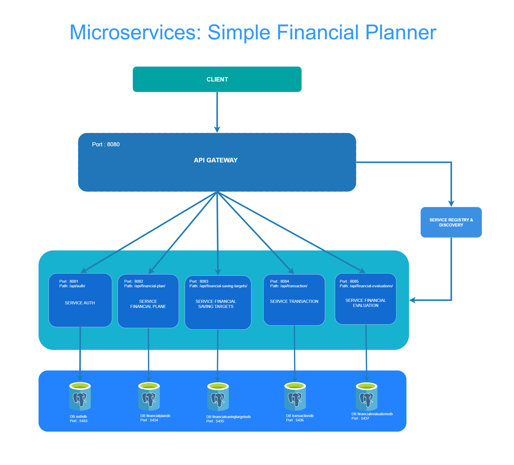

# Microservices: Simple Finance Planner

microservice-finance-planner adalah backend microservice yang dirancang untuk mengelola perencanaan keuangan pribadi secara sederhana dan efektif, khususnya untuk pekerja. Sistem ini memungkinkan pengguna untuk mencatat transaksi pemasukan dan pengeluaran, menyusun rencana keuangan bulanan, menetapkan target tabungan, serta melakukan evaluasi otomatis terhadap capaian keuangan setelah periode berjalan.


## Fitur Utama
Manajemen Pengguna:
Registrasi, autentikasi, dan pengelolaan profil pengguna.

Financial Plan:
Membuat, mengubah, dan menghapus rencana keuangan bulanan dengan catatan dan periode yang fleksibel.

Transaction Management:
Pencatatan dan pengelolaan transaksi pemasukan dan pengeluaran, termasuk kategori dan metode pembayaran (tunai, utang).

Saving Targets:
Penetapan target tabungan spesifik untuk tiap rencana keuangan, dengan jumlah dan catatan tambahan.

Finance Evaluation:
Evaluasi otomatis setelah periode rencana selesai, menghitung selisih pemasukan-pengeluaran dan pencapaian target tabungan.


## Technologies
- Spring Boot
- Spring Security 
- Spring Cloud Gateway
- JWT Authentication
- resilience4j
- PostgreSQL
- Eureka Server
- Docker
- Swagger


## Architecture Diagram
<p align="center">
  
</p>


## Microservices Overview

### api-gateway

### eureka-server

### auth-service

### financial-plan-service

### financial-evaluation-service

### transaction-service

### financial-saving-targets-service

## Dependencies

### Api-Gateway        
- `spring-cloud-starter-gateway-server-webflux`  
- `spring-boot-starter-webflux`  
- `spring-cloud-starter-netflix-eureka-client`  
- `springdoc-openapi-starter-webflux-ui`  
- `spring-cloud-starter-loadbalancer`
- `spring-boot-starter-security`
- `jjwt-api`
- `jjwt-impl`
- `jjwt-jackson`


## Database
Each service has its own separate PostgreSQL database:
- authdb
- financialplandb
- financialsavingtargetsdb
- transactiondb
- financialevaluationsdb


## Configuration

### api-gateway (application.yml)
```yaml
server:
  port: 8080

spring:
  application:
    name: api-gateway
  cloud:
    gateway:
      server:
        webflux:
          routes:
            - id: auth-service
              uri: lb://auth-service
              predicates:
                - Path=/api/auth/**
              filters:
                - RewritePath=/api/auth/(?<segment>.*), /api/auth/${segment}

            - id: financial-plan-service
              uri: lb://financial-plan-service
              predicates:
                - Path=/api/financial-plan/**
              filters:
                - RewritePath=/api/financial-plan/(?<segment>.*), /api/financial-plan/${segment}

            - id: financial-saving-targets-service
              uri: lb://financial-saving-targets-service
              predicates:
                - Path=/api/financial-saving-targets/**
              filters:
                - RewritePath=/api/financial-saving-targets/(?<segment>.*), /api/financial-saving-targets/${segment}

            - id: transaction-service
              uri: lb://transaction-service
              predicates:
                - Path=/api/transaction/**
                - Path=/api/category/**
              filters:
                - RewritePath=/api/transaction/(?<segment>.*), /api/transaction/${segment}
                - RewritePath=/api/category/(?<segment>.*), /api/category/${segment}

            - id: financial-evaluations-service
              uri: lb://financial-evaluations-service
              predicates:
                - Path=/api/financial-evaluations/**
              filters:
                - RewritePath=/api/financial-evaluations/(?<segment>.*), /api/financial-evaluations/${segment}

springdoc:
  swagger-ui:
    urls:
      - url: /api/auth/v3/api-docs
        name: Auth Service

      - url: /api/financial-plan/v3/api-docs
        name: Financial Plan Service

      - url: /api/financial-saving-targets/v3/api-docs
        name: Financial Saving Targets Service

      - url: /api/transaction/v3/api-docs
        name: transaction Service

      - url: /api/financial-evaluations/v3/api-docs
        name: financial evaluations Service


blackcode:
  app:
    jwtSecret: ${blackcode.app.jwtSecret}
    jwtExpirationMs: ${blackcode.app.jwtExpirationMs}
    jwtRefreshExpirationMs: ${blackcode.app.jwtRefreshExpirationMs}


logging:
  level:
    org.springframework.cloud.gateway: DEBUG

eureka:
  client:
    service-url:
      defaultZone: ${EUREKA_CLIENT_SERVICEURL_DEFAULTZONE:http://eurekaserver:8761/eureka/}
    register-with-eureka: true
    fetch-registry: true

```

### eureka-server (application.yml)

```yaml
server:
  port: 8761

spring:
  application:
    name: eureka-server

management:
  endpoints:
    web:
      exposure:
        include: health, info
  endpoint:
    health:
      show-details: always

logging:
  level:
    com.netflix.discovery: DEBUG

eureka:
  client:
    register-with-eureka: false
    fetch-registry: true

```

### auth-service (application.yml)

```yaml
server:
  port: 8081

spring:
  application:
    name: auth-service
  datasource:
    url: ${SPRING_DATASOURCE_URL}
    username: ${SPRING_DATASOURCE_USERNAME}
    password: ${SPRING_DATASOURCE_PASSWORD}
  jpa:
    hibernate:
      ddl-auto: update
    show-sql: true
    properties:
      hibernate:
        dialect: org.hibernate.dialect.PostgreSQLDialect

blackcode:
  app:
    jwtSecret: ${blackcode.app.jwtSecret}
    jwtExpirationMs: ${blackcode.app.jwtExpirationMs}
    jwtRefreshExpirationMs: ${blackcode.app.jwtRefreshExpirationMs}


springdoc:
  api-docs:
    path: /api/auth/v3/api-docs
  swagger-ui:
    path: /swagger-ui.html
    enabled: true

eureka:
  client:
    service-url:
      defaultZone: ${EUREKA_CLIENT_SERVICEURL_DEFAULTZONE:http://eurekaserver:8761/eureka/}
    register-with-eureka: true
    fetch-registry: true
```


### financial-plan-service
```yaml 

server:
  port: 8082

internal:
  api:
    secret: secret-key-123

spring:
  application:
    name: financial-plan-service
  datasource:
    url: ${SPRING_DATASOURCE_URL}
    username: ${SPRING_DATASOURCE_USERNAME}
    password: ${SPRING_DATASOURCE_PASSWORD}
  jpa:
    hibernate:
      ddl-auto: update
    show-sql: true
    properties:
      hibernate:
        dialect: org.hibernate.dialect.PostgreSQLDialect

resilience4j:
  circuitbreaker:
    configs:
      default:
        registerHealthIndicator: true
        slidingWindowSize: 10
        minimumNumberOfCalls: 5
        failureRateThreshold: 50
        waitDurationInOpenState: 10000
        permittedNumberOfCallsInHalfOpenState: 3
    instances:
      financialSavingTargetService:
        baseConfig: default
      transactionalService:
        baseConfig: default


  retry:
    instances:
      financialSavingTargetService:
        maxRetryAttempts: 3
        waitDuration: 2s
        retryExceptions:
          - org.springframework.web.reactive.function.client.WebClientRequestException
          - java.util.concurrent.TimeoutException
      transactionalService:
        maxRetryAttempts: 3
        waitDuration: 2s
        retryExceptions:
          - org.springframework.web.reactive.function.client.WebClientRequestException
          - java.util.concurrent.TimeoutException

management:
  endpoints:
    web:
      exposure:
        include: health,info,circuitbreakerevents

springdoc:
  api-docs:
    path: /api/financial-plan/v3/api-docs
  swagger-ui:
    path: /swagger-ui.html
    enabled: true

eureka:
  client:
    service-url:
      defaultZone: ${EUREKA_CLIENT_SERVICE_DEFAULTZONE:http://eurekaserver:8761/eureka/}
    register-with-eureka: true
    fetch-registry: true


```

### transaction-service
```yaml 
server:
  port: 8084

internal:
  api:
    secret: secret-key-123

spring:
  application:
    name: transaction-service
  datasource:
    url: ${SPRING_DATASOURCE_URL}
    username: ${SPRING_DATASOURCE_USERNAME}
    password: ${SPRING_DATASOURCE_PASSWORD}
  jpa:
    hibernate:
      ddl-auto: update
    show-sql: true
    properties:
      hibernate:
        dialect: org.hibernate.dialect.PostgreSQLDialect

resilience4j:
  circuitbreaker:
    configs:
      default:
        registerHealthIndicator: true
        slidingWindowSize: 10
        minimumNumberOfCalls: 5
        failureRateThreshold: 50
        waitDurationInOpenState: 10000
        permittedNumberOfCallsInHalfOpenState: 3
    instances:
      financialPlanService:
        baseConfig: default

  retry:
    instances:
      financialPlanService:
        maxRetryAttempts: 3
        waitDuration: 2s
        retryExceptions:
          - org.springframework.web.reactive.function.client.WebClientRequestException
          - java.util.concurrent.TimeoutException

management:
  endpoints:
    web:
      exposure:
        include: health,info,circuitbreakerevents

springdoc:
  api-docs:
    path: /api/transaction/v3/api-docs
  swagger-ui:
    path: /swagger-ui.html
    enabled: true

eureka:
  client:
    service-url:
      defaultZone: ${EUREKA_CLIENT_SERVICE_DEFAULTZONE:http://eurekaserver:8761/eureka/}
    register-with-eureka: true
    fetch-registry: true
```


### financial-saving-targets-service
```yaml 

server:
  port: 8083

internal:
  api:
    secret: secret-key-123

spring:
  application:
    name: financial-saving-targets-service
  datasource:
    url: ${SPRING_DATASOURCE_URL}
    username: ${SPRING_DATASOURCE_USERNAME}
    password: ${SPRING_DATASOURCE_PASSWORD}
  jpa:
    hibernate:
      ddl-auto: update
    show-sql: true
    properties:
      hibernate:
        dialect: org.hibernate.dialect.PostgreSQLDialect

springdoc:
  api-docs:
    path: /api/financial-saving-targets/v3/api-docs
  swagger-ui:
    path: /swagger-ui.html
    enabled: true

eureka:
  client:
    service-url:
      defaultZone: ${EUREKA_CLIENT_SERVICE_DEFAULTZONE:http://eurekaserver:8761/eureka/}
    register-with-eureka: true
    fetch-registry: true

```


### financial-evaluations-service (application.yml)

```yaml 
server:
  port: 8085

internal:
  api:
    secret: secret-key-123

spring:
  application:
    name: financial-evaluations-service
  datasource:
    url: ${SPRING_DATASOURCE_URL}
    username: ${SPRING_DATASOURCE_USERNAME}
    password: ${SPRING_DATASOURCE_PASSWORD}
  jpa:
    hibernate:
      ddl-auto: update
    show-sql: true
    properties:
      hibernate:
        dialect: org.hibernate.dialect.PostgreSQLDialect

resilience4j:
  circuitbreaker:
    configs:
      default:
        registerHealthIndicator: true
        slidingWindowSize: 10
        minimumNumberOfCalls: 5
        failureRateThreshold: 50
        waitDurationInOpenState: 10000
        permittedNumberOfCallsInHalfOpenState: 3
    instances:
      financialPlanService:
        baseConfig: default
      financialSavingTargetService:
        baseConfig: default
      transactionalService:
        baseConfig: default

  retry:
    instances:
      financialPlanService:
        maxRetryAttempts: 3
        waitDuration: 2s
        retryExceptions:
          - org.springframework.web.reactive.function.client.WebClientRequestException
          - java.util.concurrent.TimeoutException
      financialSavingTargetService:
        maxRetryAttempts: 3
        waitDuration: 2s
        retryExceptions:
          - org.springframework.web.reactive.function.client.WebClientRequestException
          - java.util.concurrent.TimeoutException
      transactionalService:
        maxRetryAttempts: 3
        waitDuration: 2s
        retryExceptions:
          - org.springframework.web.reactive.function.client.WebClientRequestException
          - java.util.concurrent.TimeoutException

management:
  endpoints:
    web:
      exposure:
        include: health,info,circuitbreakerevents

springdoc:
  api-docs:
    path: /api/financial-evaluations-service/v3/api-docs
  swagger-ui:
    path: /swagger-ui.html
    enabled: true

eureka:
  client:
    service-url:
      defaultZone: ${EUREKA_CLIENT_SERVICE_DEFAULTZONE:http://eurekaserver:8761/eureka/}
    register-with-eureka: true
    fetch-registry: true
```


## Docker & Deployment

### Run Project
```
docker-compose up --build -d
```

### Stop Project
```
docker-compose down
```

## API Documentation (Swagger UI)

The API documentation using Swagger UI can be accessed at the following base URL:
```
http://localhost:8080/swagger-ui/index.html
```

## API Endpoints

All requests are sent through the API Gateway at:
```
http://localhost:8080
```

### Endpoint: auth-service 

Base URL: `http://localhost:8080/api/auth`

| Method | Endpoint                 | Description         |
|--------|--------------------------|---------------------|
| POST   | `/registration`          | Registration User   |
| POST   | `/login`                 | Login User          |
| POST   | `/refreshtoken`          | Refresh Token       |
| POST   | `/logout`                | Logout User         |


### Endpoint: financial-plan-service
Base URL: `http://localhost:8080/api/financial-plan/`

| Method | Endpoint                 | Description         |
|--------|--------------------------|---------------------|
|        |                          |                     |


### Endpoint: financial-saving-targets-service
Base URL: `http://localhost:8080/api/financial-saving-targets/`

| Method | Endpoint                 | Description         |
|--------|--------------------------|---------------------|
|        |                          |                     |


### Endpoint: financial-evaluation-service
Base URL: `http://localhost:8080/api/financial-evaluations`

| Method | Endpoint                 | Description         |
|--------|--------------------------|---------------------|
|        |                          |                     |


### Endpoint: transaction-service

Base URL: `http://localhost:8080/api/transaction/`

| Method | Endpoint                 | Description         |
|--------|--------------------------|---------------------|
|        |                          |                     |